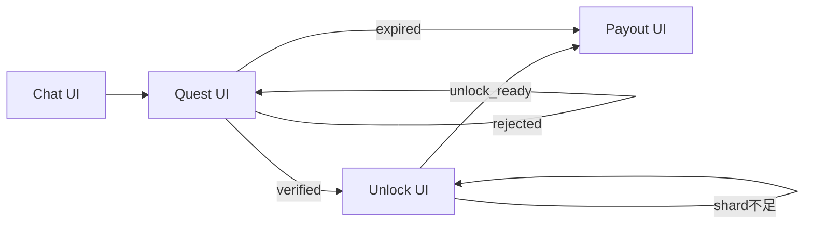
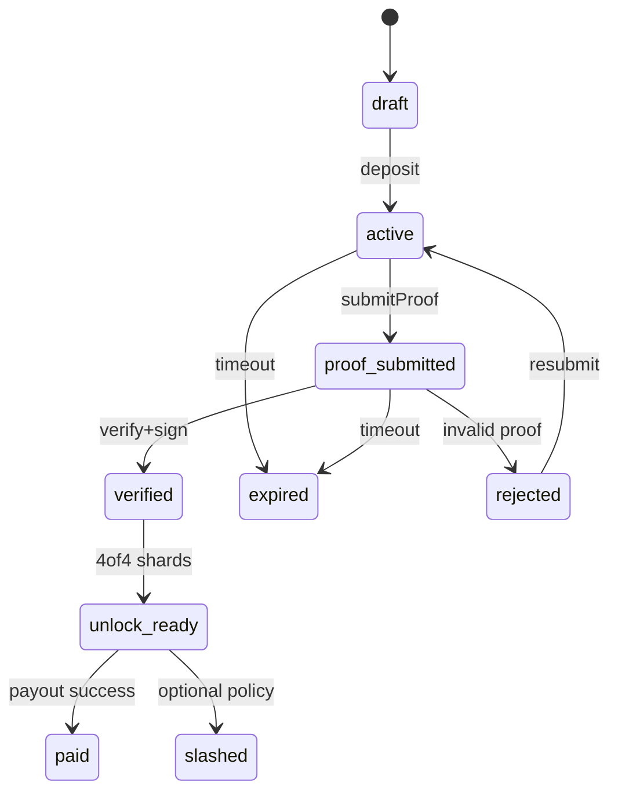

# Task 01: Product Spec / UX Flow

## Goal
プレイヤー体験を破綻なく実装できる仕様に落とし込む。

## Scope
- 対象: MVP Phase 1（Task 00準拠）
- 画面: Chat / Quest / Unlock / Payout
- 関係ロール: Deceased Agent, Player 1-4, Oracle Operator

## Screen Definition

### 1) Chat UI
- 目的: 故人AIとの対話で次アクションを確定する
- 必須要素:
  - 会話履歴（時刻、送信者、メッセージ）
  - Agent提案アクション（1件を「次アクション」として固定表示）
  - ヒントカード（証跡要件・期限・注意事項）
  - CTA: `証跡を提出する`（Quest UIへ遷移）
- 主なイベント:
  - `ACTION_SUGGESTED`
  - `HINT_UPDATED`

### 2) Quest UI
- 目的: 目標・達成条件・提出証跡の状態を管理する
- 必須要素:
  - Quest目標説明
  - 達成条件チェックリスト
  - 提出済み証跡一覧（種別、提出時刻、検証状態）
  - 不足条件リスト（未達項目）
  - CTA: `検証を依頼` / `再提出`
- 主なイベント:
  - `PROOF_SUBMITTED`
  - `PROOF_REJECTED`
  - `PROOF_VERIFIED`
  - `QUEST_EXPIRED`

### 3) Unlock UI
- 目的: 4人の参加状態とshard提出で復元可否を判断する
- 必須要素:
  - 参加者4名のステータス（未参加/参加中/提出済）
  - shard提出状況（N/4）
  - 復元可否インジケータ（`復元不可` / `復元可能`）
  - CTA: `shardを提出` / `再招集通知`
- 主なイベント:
  - `UNLOCK_PARTICIPANT_JOINED`
  - `SHARD_SUBMITTED`
  - `UNLOCK_READY`

### 4) Payout UI
- 目的: 実行トランザクション結果と分配ステータスを表示する
- 必須要素:
  - 実行Txハッシュ（エクスプローラリンク）
  - 受取先アドレス一覧
  - 分配金額（トークン種別含む）
  - ステータス（pending/success/failed）
  - 失敗時再試行導線（運用者連絡 or 再実行待ち）
- 主なイベント:
  - `PAYOUT_REQUESTED`
  - `PAYOUT_CONFIRMED`
  - `PAYOUT_FAILED`

## Navigation Flow (4 Screens)

## User Roles

### Deceased Agent
- 責務:
  - 会話応答と次アクション提案
  - 証跡取得ヒントの提示
- 制約:
  - Quest状態を直接更新しない
  - 検証確定・署名発行は不可

### Player 1-4
- 責務:
  - Quest実行と証跡提出
  - Unlockで各自shard提出
  - 結果確認（Payout UI）
- 制約:
  - 単独でunlock/payout確定不可
  - 他プレイヤーの提出内容を改変不可

### Oracle Operator（運用者）
- 責務:
  - 証跡検証の実行・差し戻し判定
  - 署名発行（検証成功時のみ）
  - 例外対応（期限切れ時の返金/寄付ポリシー適用）
- 制約:
  - 監査ログ必須
  - 手動上書きは監査理由を必須記録

## Quest State Machine

### Primary
`draft -> active -> proof_submitted -> verified -> unlock_ready -> paid`

### Failure Branches
- `active/proof_submitted -> expired`
- `proof_submitted -> rejected -> active`
- `unlock_ready -> slashed(optional)`

### Transition Guards
- `draft -> active`: deposit完了
- `active -> proof_submitted`: 必須証跡1件以上提出
- `proof_submitted -> verified`: Oracle検証成功 + 署名発行
- `verified -> unlock_ready`: 4/4 shard提出
- `unlock_ready -> paid`: on-chain payout確定
- `* -> expired`: 期限超過
- `proof_submitted -> rejected`: 証跡不正/不足
- `unlock_ready -> slashed(optional)`: 不正行為証明 + ポリシー適用時

## Failure UX

### A) shard不足時の再招集フロー
1. Unlock UIで`N/4`不足を検知
2. `再招集通知`で未提出者にプッシュ通知送信
3. 一定時間未提出なら再通知（最大回数を設定）
4. 期限到達で`expired`に遷移し資金ポリシー判定へ

### B) 証跡不正時の差し戻し
1. 検証結果を`rejected`で記録
2. 不備理由を構造化表示（例: 時刻不整合、位置情報欠落）
3. Quest UIで不足条件を再提示
4. `再提出`で`active -> proof_submitted`へ再挑戦

### C) 期限切れ時の資金扱い（返金/寄付）
- ポリシーはQuest作成時に固定:
  - `refund`: 元の拠出元へ返金
  - `donate`: 事前指定先へ寄付
- UI表示:
  - 期限切れ確定時に適用ポリシーを明示
  - 実行Txと確定ステータスをPayout UIに表示

## Notification Spec (Major Events)
- `ACTION_SUGGESTED`: Player全員へアプリ内通知
- `PROOF_SUBMITTED`: Oracle Operatorへ通知
- `PROOF_REJECTED`: 提出者へ差し戻し通知（理由付き）
- `PROOF_VERIFIED`: Player全員へunlock準備通知
- `SHARD_SUBMITTED`: 未提出Playerへ残数通知
- `UNLOCK_READY`: Player全員 + Operatorへpayout実行予定通知
- `PAYOUT_CONFIRMED`: 全員へTx hash付き完了通知
- `QUEST_EXPIRED`: 全員へ期限切れ + 資金ポリシー通知

## Task Checklist
- [x] 画面定義を確定
- [x] ユーザーロール定義
- [x] クエスト状態遷移図作成
- [x] 失敗時UX

## Acceptance Criteria
- [x] 4画面の遷移図と必須UI要素が文書化されている
- [x] 主要イベントごとにユーザー通知仕様が定義されている
